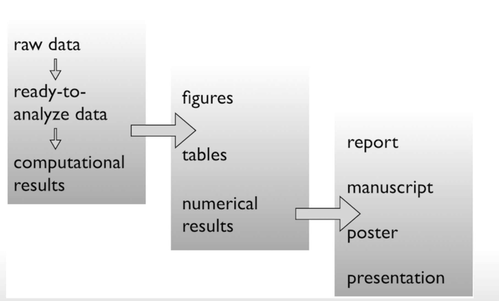

# What is Version Control?

Version Control refers to a class of systems responsible for monitoring changes to objects on your computer. These can be documents, software or images. Working with Version Control means that you can recover files or re-use specific file changes if you accidentally destroy a file or lose it.

The most common version control system (`git`) treats each individual line in a document as an individual element. When any single line is changed, `git` keeps track of the file, the line or lines that were changed, and what the new version of that line looks like. In general this is represented as _insertions_ and _deletions_.

## An Example of Changes

I've written a really basic text document:

```
Here is line one
Now this is line two
```

Now, I want to make a change:

```
Here is line one
Here is line two
```

When we check `git` we'll see that it considers that we have deleted the line `Now this is line two` and inserted the line `Here is line two`.

# Why use Version Control?

## Examples

{width=50%}

# An introduction to GitHub

At the heart of [GitHub](http://github.com) is `git`. `git` is the "language" we use to communicate with GitHub. Although `git` is mostly used for code, it can be used to manage any other type of file, such as Word documents. Think of it as a filing system for every draft of a document.

GitHub is a `git` repository hosting service with many of its own features. While `git`is a command line tool, GitHub provides a Web-based graphical interface.

Beyond managing and keeping versions of documents under control, there are other reasons for using the `git`/Github version control system:

- Github (website) can act as a back-up for files housed there
- Github can be used to host websites/blogs
- Github has a fantastic search functionality

# What is a repository?

We have said that GitHub is a repository hosting service. But what is even a repository? A repository or a "repo" is a directory or storage space where your projects can live. It can be local to a folder on your computer, or it can be a storage space on GitHub. You can keep code files, text files, image files inside a repository.

## What are important pieces in a repository (Introducing the Template keywords etcetera)

When making a repository, there are some things that you should keep in mind:

- Make your repository a well documented one. This means comments throughout, readable code and a brief summary at the top of each file that answers who wrote it, when it was written and what it does.

- Use a README.md file at the root of your repository where you document the basics of the project you are working on. Use this file to also explain what the file structure looks like and what each file contains.

- If you are going to be collaborating with others, write a Code of Conduct. A code of conduct defines standards for how to engage in a community. It signals an inclusive environment that respects all contributions. It also outlines procedures for addressing problems between members of your project's community.

- Public repositories on GitHub are often used to share open source software. For your repository to truly be open source, license it so that others can enjoy it. MIT License is one of the most common used. It is a simple permissive license with conditions only requiring preservation of copyright and license notices.

- "A place for everything, everything in its place". File organization is crucial against chaos. Make a file's name and location VERY INFORMATIVE about what it is, why it exists, how it relates to other things. The more things are self-explanatory, the better.



- Names **matter**. When naming your files, remember that you want to make sure that:

  - They are _machine readable_
  - They are _human readable_
  - They play well with default ordering - order files either chronologically or logically.

    Examples of bad names:

    - myabstract.docx
    - Joe's Filenames Use Spaces and Punctuation.xlsx
    - figure 1.png
    - JW7d^(2sl@deletethisandyourcareerisoverWx2*.txt

    Examples of good names:

    - 2014-06-08_abstract-for-sla.docx
    - joes-filenames-are-getting-better.xlsx
    - fig01_scatterplot-talk-length-vs-interest.png
    - fig02_histogram-talk-attendance.png
    - 1986-01-28_raw-data-from-challenger-o-rings.txt

- Commit to `git`every time you work on the project. When you commit, make your commit messages meaningful!

- When creating a repository, you have to think about your future users. You should be able to walk away from the project and come back to it a year later and resume work fairly quickly. Other people should be able to figure out what you did and how to continue your work.

Sounds complicated? Take a look at this template to help you out: [Throughput Template](https://github.com/throughput-ec/Template)
