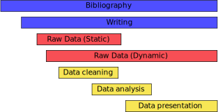

# Your Markdown Thesis

## Your Markdown Thesis

- Advantages

  - Combine code & text
  - Widely used plain-text format
  - Output to multiple formats
  - Easily tracked with `git`
  - Works with many software tools

## Your Markdown Thesis

- Disadvantages

  - Can be a pain to edit collaboratively
  - "Some" learning curve

## Overall Benefits

- Final product is reproducible
- You are awesome
- Can be easily shared, modified & updated

# Getting Started

## Start a New RMarkdown File

- Or open our file. . .

  - Fork the repository
  - Start a project from Version Control
  - Link to ThesisIsCode
  - Open the file in `thesis/myThesis_Revised.Rmd`

## How Do We Write?



## Main Elements

- Folders!

  - Figures (raw, finished)
  - Code
  - Data (input/output)
  - Save Google Sheet to file.

## Main Elements

- YAML header (metadata for the document)
- Markdown formatting
- Fenced code blocks (using backticks)

## Main Elements

- Data import
- Analysis
- Conclusions

# Then Knit!

## Let's all Gaze in Wonder

- We can knit to PDF, HTML, DOCX (and other formats)
- Options depend on header text (in part)
- RMarkdown `knit` runs code, creates a raw Markdown file, converts to new format.

## How Does it Look?

- Are there errors we can fix?
- We need to check our assumptions
- Formalize them with `assertthat()`

# Using Assertions

## Using Assertions

- We want to make sure our text follows from our analysis.

> meaning less than 300 papers about climate. Shocking!

- But is it?

## Using Assertions

```
assertthat::assert_that(climate[[1]]$hits < 300, msg="The hits are greater than 300 now!")
```

- If the assertion fails then the code doesn't knit and you have an informative error message telling you why.

# Summary

## Summary

- You've created a thesis chapter
-
